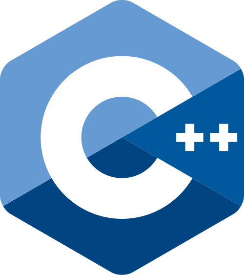
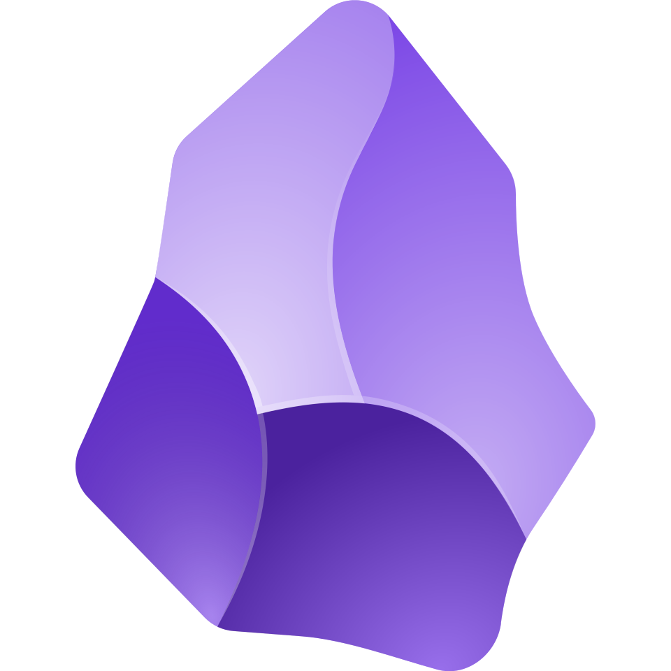
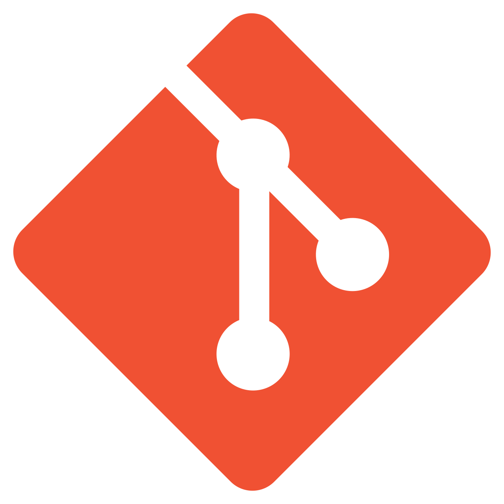
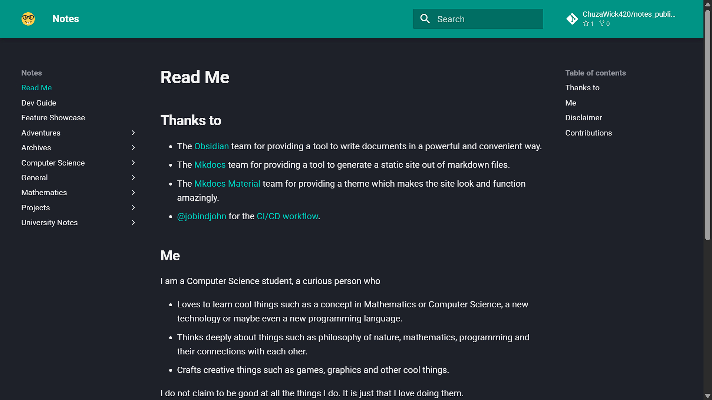
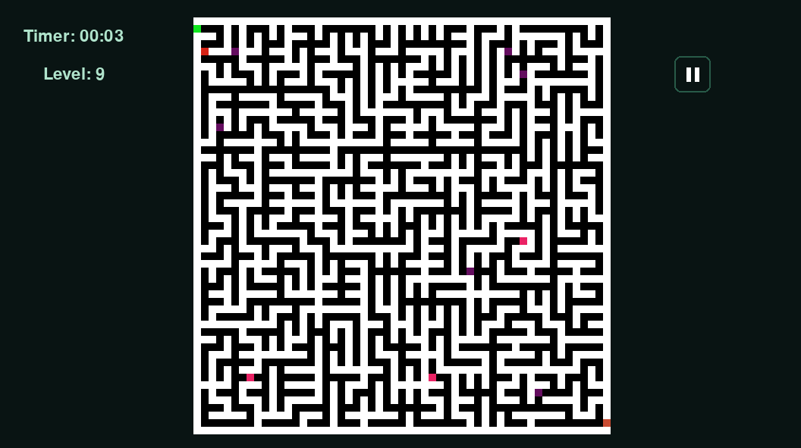

# About me

    
Computer Science student experienced in building software projects in <code>Python</code> and <code>C++</code>, including web publishing automation, game development, and multithreaded graphics programming. Strong foundation in software processes, architecture, design patterns, documentation, algorithms, data structures, version control and mathematics.

    

## Skills

### Languages

    <!--C-->
    
    <!--C++-->
    
    <!--Python-->
    
    <!--JavaScript-->
    
    <!--LaTeX-->
    
    <!--Typst-->
    

### Tools

    <!--Nvim-->
    
    <!--Obsidian-->
    
    <!--Git-->
    
    <!--SFML-->
    
    <!--Pygame-->
    

## Projects

### Notes Publisher
- Architected an automated personal knowledge-base pipeline that converts Markdown notes written in Obsidian into a published website using MkDocs, Python, and LaTeX.
- Configured a GitHub Actions workflow to automatically build and deploy the site to GitHub Pages on every push, eliminating manual deployment steps.
- Designed an automated backup workflow using Google Drive, GitHub, and GitLab to provide redundant storage and reduce risk of data loss from hardware or power failures.

### Memory Maze
- Designed and built a puzzle game engine in Python using a layered architecture, applying the Observer and Strategy design patterns to decouple game logic from the UI (made with Pygame) and persistent data.
- Built a JSON and SQLite-backed persistence layer to store game state and user data.
- Implemented time-slicing for input handling and event handling to keep the UI responsive during gameplay.

### Ray Tracing
- Developed a multi-threaded ray tracing renderer in C++ that distributes pixel computation across a configurable number of threads, boosting image generation by approximately 400% and shows the result on a SFML window.
- Built a JSON-driven configuration system covering four parameter groups — scene objects (size, color, material, position), camera (position, orientation, focal length), image output (dimensions, samples per pixel), and thread count — so scenes can be re-rendered without touching code.

## Interests

- Mathematics
- Computer Graphics
- Systems

## Socials

<table style="
    display: flex;
    justify-content: center;
">
    <tr>
        <th>Type</th>
        <th>Platform</th>
    </tr>
    <tr>
        <td>Dev</td>
        <td>
            

                <!--Gitlab-->
                
                <!--Linked in-->
                
            

        </td>
    </tr>
    <tr>
        <td>Art</td>
        <td>
            

                <!--Artstation-->
                
                <!--Pininterest-->
                
            

        </td>
    </tr>
    <tr>
        <td>Others</td>
        <td>
            

                <!--Instagram-->
                
                <!--FaceBook-->
                
            

        </td>
    </tr>
</table>

[|Game|
<!--Itch.io--><a href="https://chuzawick420.itch.io/" target="_blank"></img></a><!--Steam-->
|]: #

[|Nerding out|
<!--ShaderToy--><!--NexusMods--><!--CurseForge--><!--Modrinth-->    <!--ShaderLabs-->
|]: #

[|Freelance|
<!--Upwork--><!--Fivver-->
|]: #

[## Languages]: #
[used languages card goes here - https://github-readme-stats.vercel.app/api/top-langs?username=ChuzaWick420&bg_color=60,001a33,990000&text_color=00b3b3&title_color=ff1a1a&border_radius=15&layout=donut]: #

## Languages Used

    

